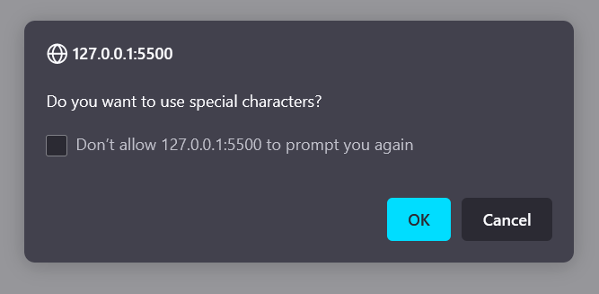

# password-generator

## Description

Create a password generator that can be used to generate a random password to the requirements selected by the user. The user will be able to specify:
- The length of the password, between 10 and 64 character.
- Which of the following character types to use:
  - Special characters.
  - Numeric.
  - Uppercase.
  - Lowercase. 

The following images show a sample of the web application's appearance and functionality:

## Usage

To use the application, navigate to [https://fezzer.github.io/password-generator/](https://fezzer.github.io/password-generator/) and click the "Generate Password" button.

You must enter a password length between 10 and 64 characters and select at least one character type.

## License

Please refer to the license in the repo.